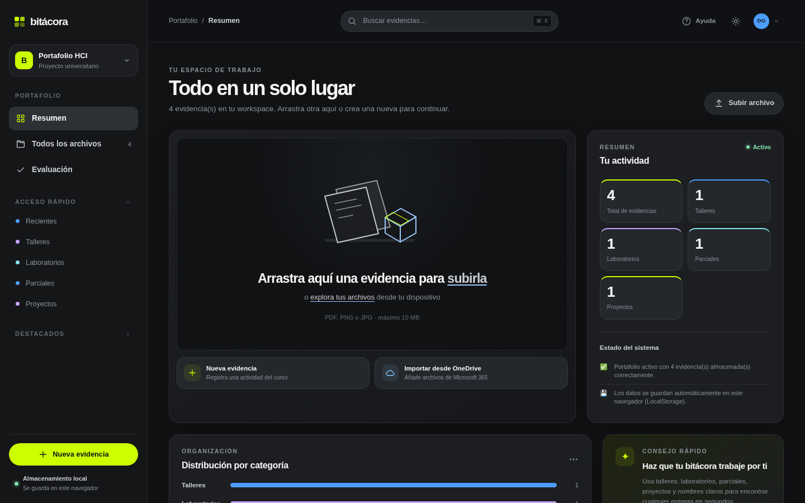

# 📘 Sistema de Portafolio Digital - Bitácora HCI

<div align="center">
  
  
  
  
</div>

<br>

<div align="center">
  
</div>

---

## 🚀 Live Demo
**[🌐 Probar la aplicación en vivo aquí](https://devG3r4.github.io/HCI-PytFinal)**

## 📖 Acerca del Proyecto
Este repositorio contiene el proyecto final para el curso de **Interacción Humano-Computador (HCI)**. Se trata de una **Bitácora Digital** moderna, diseñada bajo los principios del **Diseño Centrado en el Usuario (DCU)** y las heurísticas de usabilidad de Nielsen. 

El sistema permite a los estudiantes organizar, almacenar y visualizar todas las evidencias del curso (talleres, laboratorios, parciales y proyectos) en una interfaz limpia, intuitiva y rápida, inspirada en plataformas profesionales de almacenamiento en la nube.

## ✨ Características Principales

*   **📂 Organización Inteligente:** Filtrado y categorización automática de evidencias (Talleres, Laboratorios, Parciales, Proyectos).
*   **☁️ Almacenamiento en la Nube:** Integración nativa con la API de Cloudinary para el manejo eficiente de archivos adjuntos (imágenes y PDFs).
*   **🔗 Soporte para OneDrive:** Preparado para importar archivos directamente desde Microsoft 365 mediante Microsoft Graph.
*   **🌓 Tema Adaptable:** Interfaz moderna con Modo Oscuro (Dark Mode) por defecto y soporte para Modo Claro (Legacy).
*   **🖱️ Drag & Drop:** Área funcional para arrastrar y soltar archivos, mejorando la eficiencia y experiencia del usuario.
*   **💾 Persistencia Local:** Todo el estado de la aplicación se guarda de forma segura y rápida en el navegador.

## 🛠️ Instalación y Uso Local

Si deseas correr el proyecto en tu propia máquina, es súper sencillo:

1. Clona el repositorio:
   ```bash
   git clone https://github.com/devG3r4/HCI-PytFinal.git
   ```
2. Entra a la carpeta del proyecto:
   ```bash
   cd HCI-PytFinal
   ```
3. Inicia un servidor web local (por ejemplo, con Python):
   ```bash
   python -m http.server 5500
   ```
4. Abre tu navegador y navega a `http://localhost:5500`.

## 📚 Documentación y Pruebas DCU
Como parte integral de la materia de HCI, todo el proceso de diseño y validación está rigurosamente documentado. Puedes encontrar todas las evidencias en la carpeta `/evidencias/dcu/`:
*   Matriz de requisitos funcionales y de usuario.
*   Definición de Proto-personas.
*   Evaluación Heurística de la interfaz.
*   Recorrido Cognitivo (*Cognitive Walkthrough*).
*   Arquitectura de la información.
*   Instrumentos y resultados de Pruebas con Usuarios reales.

---
*Proyecto académico desarrollado para demostrar competencias avanzadas en usabilidad, accesibilidad y diseño de interfaces web interactivas.*
